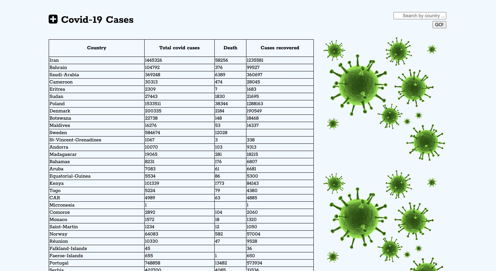

# covid-19
Gives you a data on covid-19 cases (Total covid cases,Deaths, Recovered) of all countries

Gives you a data on covid-19 cases of specific country on request.

(The data are updated every day @ 22:10(GMT time))

# Technology Used

-HTML
-CSS
-Javascript

# User Storiess

Heatlth worker, Goverment bodies could use this service to retrieve the information for analyse and planning purpose.

General People could use this service to get the updates on the the latest covid-19 cases.

# Wire Framework

